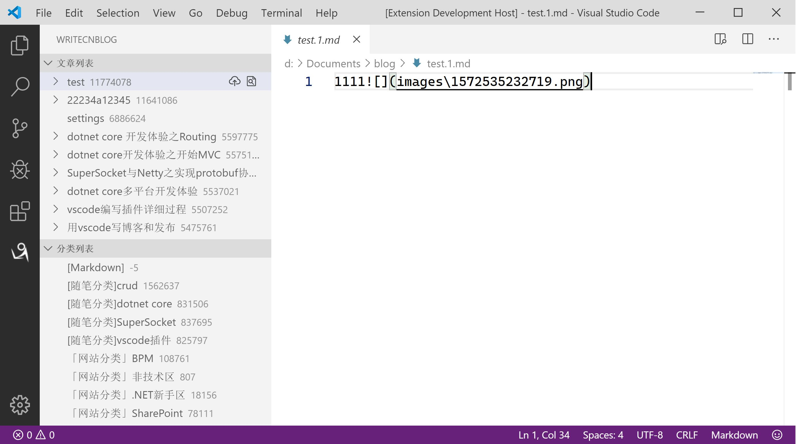

# WriteCnblog README

官方出了自己的插件地址 https://github.com/cnblogs/vscode-cnb

博客园的协议也有做了点改变，导致这个插件不兼容了。这个插件`不维护了`

"WriteCnblog" 是一个基于rpcxml协议给[博客园](http://www.cnblogs.com/)发布Markdown格式的插件

## Features

- [X]  选择博客工作空间
- [X]  配置并登录
- [X]  新建文章
- [X]  拉取最近文章
- [X]  保存草稿
- [X]  发布文章
- [X]  比较修改文章
- [X]  删除文章
- [X]  选择文章分类
- [X]  新增分类
- [X]  跳转文章网页

## Requirements

需要vs code版本在1.31.0以上。

## Extension Settings

* `writeCnblog.rpcUrl`: 博客园的MetaWeblog接口地址（我的博客管理 -> [设置](https://i.cnblogs.com/Configure.aspx)，拉到最下面，有个MetaWeblog访问地址）
* `writeCnblog.userName`: 博客园的用户名
* `writeCnblog.blogId`: 博客id（设置配置后，成功登录会自动获取）
* `writeCnblog.blogWorkspace`: 工作空间（存放博客文章的相关内容）
* `writeCnblog.recentPostCount`: 最近文章的数量

## Known Issues

- 修改文章后保存，文章列表状态不会立刻变化
- 如果文章里面的图片地址是网络地址，那么提交后，更新到本地会导致文章一直显示为修改状态
- 批量拉取文章和单独拉取文章，文章的分类会有所不同，博客园返回的接口就是如此

## Release Notes

[CHANGELOG](CHANGELOG.md)

### For more information

* [Visual Studio Code's Markdown Support](http://code.visualstudio.com/docs/languages/markdown)
* [Markdown Syntax Reference](https://help.github.com/articles/markdown-basics/)

**Enjoy!**
